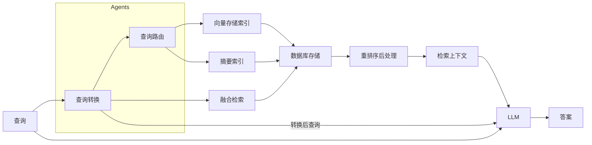
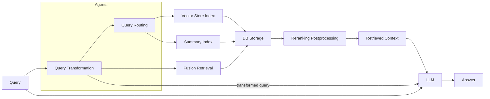

# 高级RAG架构

## 概述

本节描述了高级检索增强生成（RAG）系统架构，该架构通过复杂的查询处理和多索引检索增强了传统RAG系统的功能。

## 系统组件

### 查询处理
1. **初始查询**
   - 用户问题的入口点
   - 原始查询格式

2. **查询转换**
   - 位于Agents子系统中
   - 处理和重新格式化传入的查询
   - 输出转换后的查询和查询列表
   - 接收查询优化反馈

3. **查询路由**
   - 确定最佳检索策略
   - 基于查询特征选择工具
   - 将查询导向适当的索引

### 存储和检索
1. **数据库存储**
   - 中央存储系统
   - 连接多个索引系统
   - 存储向量和摘要数据

2. **索引系统**
   - 向量存储索引
     - 管理嵌入的向量表示
     - 启用语义搜索功能
   
   - 摘要索引
     - 存储文档的压缩表示
     - 便于快速上下文检索

3. **融合检索**
   - 合并来自多个来源的结果
   - 整合不同的检索策略

### 后处理
1. **重排序后处理**
   - 优化和重新排序检索结果
   - 提高最终上下文的相关性

2. **检索上下文**
   - 经过处理和排序的信息
   - 准备供LLM使用

### LLM集成
- 接收多个输入：
  - 原始查询
  - 转换后的查询
  - 检索的上下文
- 基于综合输入生成最终答案

## 数据流

## 处理流程

1. 用户查询进入系统
2. 查询在Agents子系统中进行转换
3. 查询路由确定最佳检索策略
4. 咨询多个索引（向量存储和摘要）
5. 融合检索合并来自不同来源的结果
6. 结果存储在中央数据库中
7. 后处理重排序和优化检索到的信息
8. LLM接收多个输入以生成最终答案

这种高级架构通过多阶段处理和多重检索策略实现了更复杂和准确的响应。

---

# Advanced RAG Architecture

## Overview

This section describes the advanced Retrieval-Augmented Generation (RAG) system architecture, which enhances the capabilities of traditional RAG systems through sophisticated query processing and multi-index retrieval.

## System Components

### Query Processing
1. **Initial Query**
   - Entry point for user questions
   - Raw query format

2. **Query Transformation**
   - Located in Agents subsystem
   - Processes and reformats incoming queries
   - Outputs transformed queries and query lists
   - Receives feedback for query refinement

3. **Query Routing**
   - Determines optimal retrieval strategy
   - Makes tool choices based on query characteristics
   - Directs queries to appropriate indexes

### Storage and Retrieval
1. **DB Storage**
   - Central storage system
   - Connects with multiple indexing systems
   - Stores both vector and summary data

2. **Index Systems**
   - Vector Store Index
     - Manages embedded vector representations
     - Enables semantic search capabilities
   
   - Summary Index
     - Stores condensed document representations
     - Facilitates quick context retrieval

3. **Fusion Retrieval**
   - Combines results from multiple sources
   - Integrates different retrieval strategies

### Post-Processing
1. **Reranking Postprocessing**
   - Refines and reorders retrieved results
   - Improves relevance of final context

2. **Retrieved Context**
   - Processed and ranked information
   - Ready for LLM consumption

### LLM Integration
- Receives multiple inputs:
  - Original query
  - Transformed queries
  - Retrieved context
- Generates final answer based on comprehensive input

## Data Flow

## Process Description

1. User query enters the system
2. Query undergoes transformation in the Agents subsystem
3. Query routing determines optimal retrieval strategy
4. Multiple indexes (Vector Store and Summary) are consulted
5. Fusion retrieval combines results from different sources
6. Results are stored in the central database
7. Post-processing reranks and refines the retrieved information
8. LLM receives multiple inputs to generate the final answer

This advanced architecture enables more sophisticated and accurate responses through multi-stage processing and multiple retrieval strategies. 