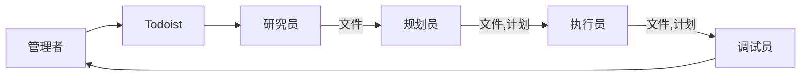
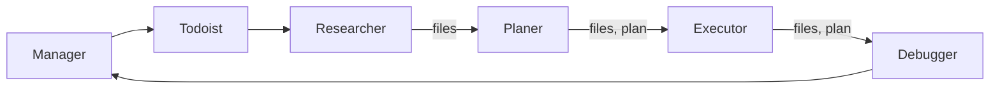

# AI 工作流程

## 概述

本文档描述了 AI 辅助项目管理和执行的工作流程。

## 工作流组件

### 管理者
- 角色：项目发起者和监督者
- 职责：规划和启动项目
- 连接：与 Todoist 进行任务管理交互

### Todoist
- 角色：任务管理系统
- 功能：任务组织和分发的中心枢纽
- 连接：接收来自管理者的任务并转发给 AI 工作流系统

### AI 工作流系统

AI 系统由四个按顺序工作的主要组件组成：

1. **研究员**
   - 主要功能：寻找需要处理的项目文件
   - 输入：来自 Todoist 的任务
   - 输出：相关文件以供处理
   
2. **规划员**
   - 主要功能：制定变更计划
   - 输入：来自研究员的文件
   - 输出：详细计划和执行文件
   
3. **执行员**
   - 主要功能：快速实施计划的变更
   - 输入：来自规划员的文件和计划
   - 输出：已实施的变更
   
4. **调试员**
   - 主要功能：根据需要提供改进和调试
   - 输入：来自执行员的文件和计划
   - 输出：经过改进和调试的实现
   - 连接：可以向管理者提供反馈以持续改进

## 数据流

工作流程遵循线性进展：

## 流程说明

1. 管理者通过在 Todoist 创建任务来启动项目
2. 研究员分析任务并收集相关项目文件
3. 规划员基于收集的信息制定战略计划
4. 执行员实施计划的变更
5. 调试员确保质量并提供必要的改进
6. 结果反馈给管理者进行审查

该工作流程通过适当的规划、执行和质量控制确保任务的系统化处理。

---

# AI Workflow Process

## Overview

This document describes the workflow process for AI-assisted project management and execution.

## Workflow Components

### Manager
- Role: Project initiator and overseer
- Responsibility: Plans and initiates projects
- Connection: Interacts with Todoist for task management

### Todoist
- Role: Task management system
- Function: Central hub for task organization and distribution
- Connection: Receives tasks from Manager and forwards them to the AI workflow system

### AI Workflow System

The AI system consists of four main components working in sequence:

1. **Researcher**
   - Primary function: Looks for project files to work on
   - Input: Task from Todoist
   - Output: Relevant files for processing
   
2. **Planer**
   - Primary function: Invents plan of changes
   - Input: Files from Researcher
   - Output: Detailed plan and files for execution
   
3. **Executor**
   - Primary function: Quickly introduces planned changes into life
   - Input: Files and plan from Planer
   - Output: Implemented changes
   
4. **Debugger**
   - Primary function: Provides improvements and debugging if needed
   - Input: Files and plan from Executor
   - Output: Refined and debugged implementation
   - Connection: Can provide feedback to Manager for continuous improvement

## Data Flow

The workflow follows a linear progression:

## Process Description

1. Manager initiates a project by creating a task in Todoist
2. Researcher analyzes the task and gathers relevant project files
3. Planer develops a strategic plan based on the gathered information
4. Executor implements the planned changes
5. Debugger ensures quality and provides necessary improvements
6. Results are reported back to the Manager for review

This workflow ensures systematic processing of tasks with proper planning, execution, and quality control.

