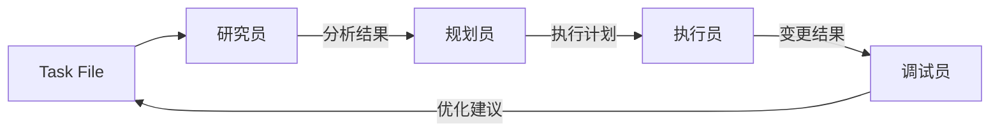
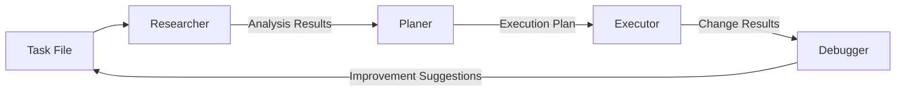

# AI 工作流程

## 概述

本文档描述了基于本地文件系统的 AI 辅助项目管理和执行工作流程。

## 工作流组件

### 本地文件系统
- 角色：任务和数据管理系统
- 目录结构：
  - ai/tasks/{task_id}.md：任务管理文件
  - ai/roles/：角色定义和配置
  - ai/var/：运行时数据
  - ai/ref/：参考文档

### AI 工作流系统

AI 系统由四个主要角色组成，每个角色都通过本地文件系统进行交互：

1. **研究员**
   - 主要功能：分析任务需求和收集相关文件
   - 输入：ai/tasks/{task_id}.md 中的任务描述
   - 输出：相关文件列表和初步分析
   
2. **规划员**
   - 主要功能：制定变更计划
   - 输入：研究员的分析结果
   - 输出：详细执行计划
   
3. **执行员**
   - 主要功能：实施计划变更
   - 输入：规划员的执行计划
   - 输出：代码变更和执行记录
   
4. **调试员**
   - 主要功能：验证和优化执行结果
   - 输入：执行员的变更结果
   - 输出：优化建议和问题修复

## 数据流

工作流程遵循线性进展，所有数据通过本地文件系统流转：



## 工作流程

1. 任务启动
   - 在 ai/tasks/ 目录下创建新的任务文件
   - 任务文件包含：描述、状态、计划、记录

2. 角色切换
   - 每次对话开始时指定当前角色
   - 角色在任务文件中记录工作内容
   - 角色交接通过任务文件进行

3. 数据管理
   - 所有数据存储在本地目录
   - 使用 Git 进行版本控制
   - 重要中间结果保存在 ai/var/ 目录

4. 持续性保证
   - 任务状态实时更新到任务文件
   - 每个角色的工作记录可追溯
   - 支持任务暂停和恢复

## 使用方法

1. 创建新任务：
   ```bash
   # 手动创建或使用工具创建任务文件
   touch ai/tasks/task_name.md
   ```

2. 角色切换：
   ```
   # 在对话中指定角色
   "请以研究员角色继续 task_name 任务"
   ```

3. 查看进度：
   ```bash
   # 直接查看任务文件
   cat ai/tasks/task_name.md
   ```

该工作流程完全基于本地文件系统，无需外部依赖，保证了数据安全性和工作连续性。

---

# AI Workflow Process

## Overview

This document describes the workflow process for AI-assisted project management and execution.

## Workflow Components

### Local File System
- Role: Task and data management system
- Directory structure:
  - ai/tasks/{task_id}.md: Task management file
  - ai/roles/: Role definition and configuration
  - ai/var/: Runtime data
  - ai/ref/: Reference documents

### AI Workflow System

The AI system consists of four main components working in sequence:

1. **Researcher**
   - Primary function: Analyzes task requirements and gathers relevant files
   - Input: Task description from ai/tasks/{task_id}.md
   - Output: List of relevant files and initial analysis
   
2. **Planer**
   - Primary function: Invents plan of changes
   - Input: Researcher's analysis results
   - Output: Detailed execution plan
   
3. **Executor**
   - Primary function: Implements planned changes
   - Input: Planer's execution plan
   - Output: Code changes and execution records
   
4. **Debugger**
   - Primary function: Validates and optimizes execution results
   - Input: Executor's change results
   - Output: Improvement suggestions and problem fixes

## Data Flow

The workflow follows a linear progression, with all data flowing through the local file system:



## Process Description

1. Task initiation
   - Create a new task file in the ai/tasks/ directory
   - Task file includes: Description, Status, Plan, Record

2. Role switching
   - Specify the current role at the start of each conversation
   - Role records work in the task file
   - Role交接通过任务文件进行

3. Data management
   - All data stored in local directory
   - Use Git for version control
   - Important intermediate results stored in ai/var/ directory

4. Continuous guarantee
   - Task status updated in task file
   - Work records traceable for each role
   - Supports task pause and recovery

## Usage

1. Create a new task:
   ```bash
   # Manually create or use tool to create task file
   touch ai/tasks/task_name.md
   ```

2. Role switching:
   ```
   # Specify role in conversation
   "Please continue task_name task as researcher role"
   ```

3. Check progress:
   ```bash
   # Directly view task file
   cat ai/tasks/task_name.md
   ```

This workflow is completely based on local file system, without external dependency, ensuring data security and work continuity.

