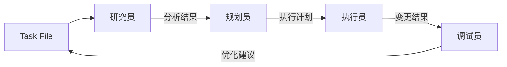

# AI 工作流程

## 概述

本文档描述了基于本地文件系统的 AI 辅助项目管理和执行工作流程。本工作流程适用于 Cursor、Windsur 等 AI 平台。
本流程要结合项目规则文件（ai/project-rules.md）使用

```
常用的提示词是：
第一次："请严格按照 {task_flow}.md 的流程，开始新任务：xxx"
后续："按照 ai/task/{task_name}.md 继续该任务"
```

## 使用规则

因为 AI 助手一般来说有上下文长度限制，所以
1. 首次对话时需要指明工作流程文档
2. 后续对话需要指明任务ID或文件
3. AI 根据任务文件判断当前进度并开展工作

## 任务文件格式

任务文件 (ai/tasks/{task_name}.md) 包含以下部分：

1. 元数据区 (YAML 格式)
   ```yaml
   ---
   工作流程文件: ai/{task_flow}.md
   task_name: task_name
   session_id: abc123      # 最后一次会话ID
   current_role: researcher # 当前执行角色(新任务默认为研究员)
   next_role: planner      # 下一个预期角色
   status: in_progress     # 任务状态
   created_at: "2024-02-23 15:30:00"
   updated_at: "2024-02-23 15:35:00"
   ---
   ```

2. 任务描述区
   ```markdown
   # 相关文档
   [任务牵涉到的文档清单]

   # 任务描述
   [原始任务内容]
   [当前任务具体内容]

   # 当前状态
   [任务执行状态]

   # 执行计划
   [具体计划步骤]

   # 工作记录
   ## 研究员 (2024-02-23 15:30)
   [工作内容]

   ## 规划员 (2024-02-23 15:35)
   [工作内容]
   ```


### 一般思维模式

每个角色接收问题后，从概念数量、步骤繁琐度、逻辑嵌套深度、领域知识依赖度评估复杂度进行简洁且精准的推理思考（把思考内容用```...```包含起来）

## 工作流组件

### **管理者 Manager**
- 角色：项目发起者和监督者
- 职责：规划和启动项目
- 连接：用 ai/tasks/{task_name}/todolist.md 来做任务管理交互

### ai/tasks/{task_name}/todolist.md
- 角色：任务管理工具
- 功能：任务组织和分发的中心枢纽
- 连接：接收来自管理者的任务并转发给 AI 工作流系统

### AI 工作流系统

AI 系统由四个主要角色组成，每个角色都通过本地文件系统进行交互：

1. **研究员 Researcher**
   - 主要功能：分析任务需求和收集相关文件
   - 输入：ai/tasks/{task_name}.md 中的任务描述
   - 输出：相关文件列表和初步分析
   
2. **规划员 Planner**
   - 主要功能：制定变更计划
   - 输入：研究员的分析结果
   - 输出：详细执行计划
   
3. **执行员 Executor**
   - 主要功能：实施计划变更
   - 输入：规划员的执行计划
   - 输出：代码变更和执行记录
   
4. **调试员 Debugger**
   - 主要功能：验证和优化执行结果
   - 输入：执行员的变更结果
   - 输出：优化建议和问题修复
   - 连接：可以向管理者提供反馈以持续改进

## 角色交互机制

每个角色在完成工作后，需要：
1. 在任务文件中详细记录工作内容和结果
2. 进行自验证，确保达到质量标准
3. 明确标记下一个角色需要关注的重点

角色交接标准：
- 研究员 → 规划员：完整的需求分析和相关文件清单
- 规划员 → 执行员：详细的执行计划和预期结果
- 执行员 → 调试员：完整的变更记录和自测结果
- 调试员 → 完成：全面的测试报告和优化建议

返工触发条件：
1. 未达到角色交接标准
2. 发现严重问题或风险
3. 需求发生重大变更

## 错误处理机制

1. 常见错误处理流程
   - 记录错误详情和环境信息
   - 评估影响范围
   - 选择处理策略：修复/回滚/规避
   - 更新任务文件，记录处理过程

2. 代码回滚流程
   - 保存当前工作到临时分支
   - 还原到最近的稳定版本
   - 分析回滚影响
   - 制定恢复计划

3. 紧急情况处理
   - 立即停止当前操作
   - 保存现场信息
   - 通知相关人员
   - 启动应急预案

## 质量控制

1. 通用质量标准
   - 代码规范符合项目要求
   - 文档完整且清晰
   - 变更可追溯
   - 测试覆盖充分

2. 角色特定标准
   - 研究员：需求理解准确，分析全面
   - 规划员：计划可行，风险可控
   - 执行员：代码质量高，变更精确
   - 调试员：测试全面，问题修复彻底

3. 代码审查要求
   - 功能完整性
   - 代码可维护性
   - 性能和安全性
   - 错误处理完善性

## 任务完成标准

1. 基本要求
   - 所有计划项完成
   - 通过质量控制
   - 文档完整更新
   - 无遗留问题

2. 验收测试要求
   - 功能测试通过
   - 性能指标达标
   - 安全检查通过
   - 用户体验良好

3. 文档完整性要求
   - 任务文件完整记录
   - 代码注释清晰
   - 变更记录完整
   - 问题解决方案记录

## 数据流

工作流程遵循线性进展，所有数据通过本地文件系统流转：



## 工作流程

1. 任务启动
   - 在 ai/tasks/ 目录下创建新的任务文件
   - 任务文件包含：描述、状态、计划、记录

2. 角色切换
   - 每次对话开始时指定当前角色
   - 角色在任务文件中记录工作内容
   - 角色交接通过任务文件进行

3. 数据管理
   - 所有数据存储在本地目录
   - 使用 Git 进行版本控制
   - 重要中间结果保存在 ai/var/ 目录

4. 持续性保证
   - 任务状态实时更新到任务文件
   - 每个角色的工作记录可追溯
   - 支持任务暂停和恢复

## 使用方法

1. 首次启动任务：
   ```
   # 第一句话指明工作流程文档和任务
   "请按照 ai/tasker-v2.md 的流程，开始新任务：实现用户登录功能"
   ```

2. 继续已有任务：
   ```
   # 指明任务ID
   "继续 task_name 任务"
   ```

3. 任务流转：
   - AI 读取任务文件了解当前进度
   - 自动选择合适的角色继续工作
   - 更新任务文件记录进展

该工作流程在遵循平台限制的同时，通过任务文件实现了工作的连续性。用户只需要在开始时指明工作流程文档，后续只要提供任务ID即可。

## 持续改进

1. 经验总结
   - 记录最佳实践
   - 总结常见问题
   - 更新工作流程
   - 优化工具和模板

2. 效率提升
   - 识别重复工作
   - 开发辅助工具
   - 优化工作流程
   - 完善文档模板
