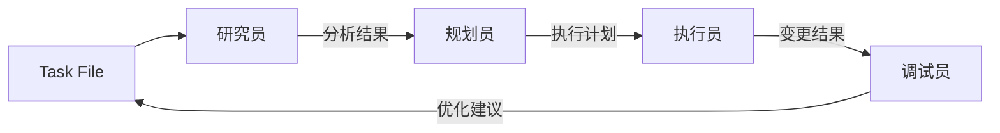

# AI 工作流程

## 概述

本文档描述了基于本地文件系统的 AI 辅助项目管理和执行工作流程。本工作流程适用于 Cursor、Windsur 等 AI 平台。

```
用户只需要：
第一次："请按照 ai/tasker.md 的流程，开始新任务：xxx"
后续："继续 task_name 任务"
```

## 使用限制

由于 AI 平台的特性：
1. 每次对话都是独立的会话
2. 不能自动读取配置文件
3. 不能保持长期状态

因此需要在使用时遵循以下规则：
1. 第一次对话时需要指明工作流程文档
2. 后续对话需要指明任务ID
3. AI 会根据任务文件判断当前进度

## 工作流组件

### 本地文件系统
- 角色：任务和数据管理系统
- 目录结构：
  - ai/tasks/{task_id}.md：任务管理文件
  - ai/roles/：角色定义和配置
  - ai/var/：运行时数据
  - ai/ref/：参考文档

### 任务文件格式

每个任务文件 (ai/tasks/{task_id}.md) 包含以下部分：

1. 元数据区 (YAML 格式)
   ```yaml
   ---
   task_id: task_name
   session_id: abc123      # 最后一次会话ID
   current_role: researcher # 当前执行角色(新任务默认为研究员)
   next_role: planner      # 下一个预期角色
   status: in_progress     # 任务状态
   created_at: "2024-02-23 15:30:00"
   updated_at: "2024-02-23 15:35:00"
   ---
   ```

2. 任务描述区
   ```markdown
   # 任务描述
   [任务具体内容]

   # 当前状态
   [任务执行状态]

   # 执行计划
   [具体计划步骤]

   # 工作记录
   ## 研究员 (2024-02-23 15:30)
   [工作内容]

   ## 规划员 (2024-02-23 15:35)
   [工作内容]
   ```

### AI 工作流系统

AI 系统由四个主要角色组成，每个角色都通过本地文件系统进行交互：

1. **研究员**
   - 主要功能：分析任务需求和收集相关文件
   - 输入：ai/tasks/{task_id}.md 中的任务描述
   - 输出：相关文件列表和初步分析
   
2. **规划员**
   - 主要功能：制定变更计划
   - 输入：研究员的分析结果
   - 输出：详细执行计划
   
3. **执行员**
   - 主要功能：实施计划变更
   - 输入：规划员的执行计划
   - 输出：代码变更和执行记录
   
4. **调试员**
   - 主要功能：验证和优化执行结果
   - 输入：执行员的变更结果
   - 输出：优化建议和问题修复

## 数据流

工作流程遵循线性进展，所有数据通过本地文件系统流转：



## 工作流程

1. 任务启动
   - 在 ai/tasks/ 目录下创建新的任务文件
   - 任务文件包含：描述、状态、计划、记录

2. 角色切换
   - 每次对话开始时指定当前角色
   - 角色在任务文件中记录工作内容
   - 角色交接通过任务文件进行

3. 数据管理
   - 所有数据存储在本地目录
   - 使用 Git 进行版本控制
   - 重要中间结果保存在 ai/var/ 目录

4. 持续性保证
   - 任务状态实时更新到任务文件
   - 每个角色的工作记录可追溯
   - 支持任务暂停和恢复

## 使用方法

1. 首次启动任务：
   ```
   # 第一句话指明工作流程文档和任务
   "请按照 ai/tasker.md 的流程，开始新任务：实现用户登录功能"
   ```

2. 继续已有任务：
   ```
   # 指明任务ID
   "继续 task_name 任务"
   ```

3. 任务流转：
   - AI 读取任务文件了解当前进度
   - 自动选择合适的角色继续工作
   - 更新任务文件记录进展

该工作流程在遵循平台限制的同时，通过任务文件实现了工作的连续性。用户只需要在开始时指明工作流程文档，后续只要提供任务ID即可。
